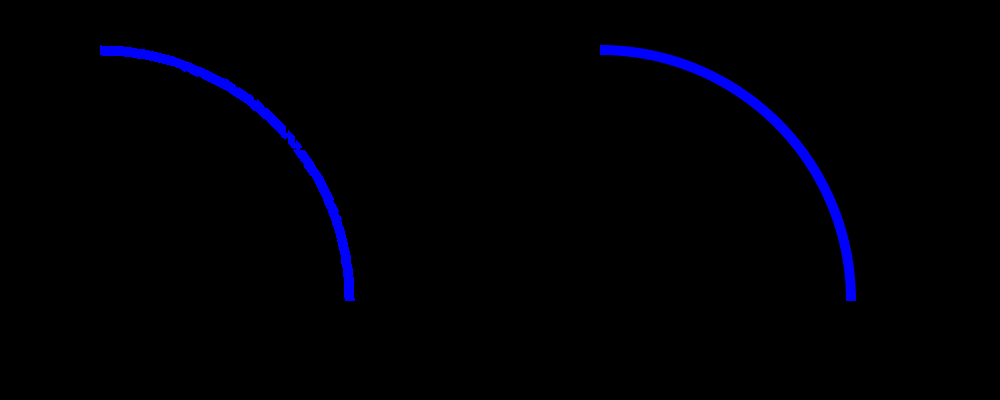
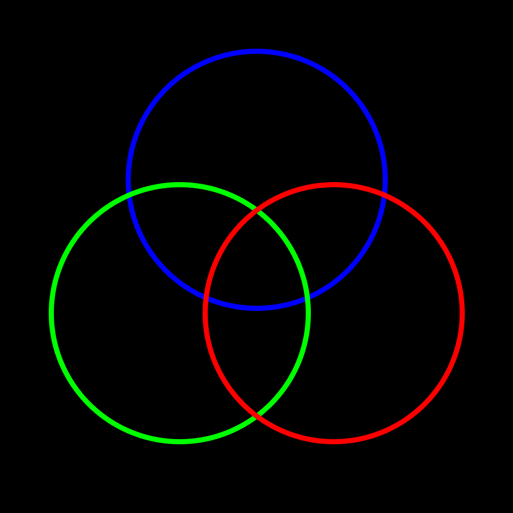

# smooth_image_arc

An anti-aliased alternative to the imagearc function from the GD library in PHP.

### Background

PHP's GD library includes functions such as `imagearc` and `imagefilledarc` that can be used to draw arcs and ellipses. However, the images produced by these functions suffer from aliasing.

http://www.ulrichmierendorff.com/software/antialiased_arcs.html presents an anti-aliased alternative to the `imagefilledarc` function, which allows you to draw smooth, filled arcs. 

The smoothImageArc function follows a similar approach to provide an anti-aliased alternative to the `imagearc` function.



The arc on the left has been drawn with the GD `imagearc` function, and the arc on the right has been drawn with `imagefilledarc`.

### Quick Example

```php
<?php

/*
An example script to demonstrate the usage of the smoothImageArc functions to draw circles.
*/

include('./smoothImageArc.php');

// create a 1000-by-1000 pixel image
$img = imagecreatetruecolor(1000, 1000);

// create some colour arrays
$blue = array(0, 0, 255, 0);
$green = array(0, 255, 0, 0);
$red = array(255, 0, 0, 0);

// draw some circles
imagesetthickness($img, 1);     // line thickness must be set to 1 pixel
smoothImageArc($img, 500, 350, 10, 250, 0, 360, $blue);
smoothImageArc($img, 350, 610, 10, 250, 0, 360, $green);
smoothImageArc($img, 650, 610, 10, 250, 0, 360, $red);

// save image to file
header("Content-type: image/png");
imagepng($img, "quick_example.png");

// free memory
imagedestroy($img);

?>
```

This example renders the following image:



More examples can be found in the `examples` directory.

### License

Distributed under the MIT License. More information can be found in `LICENSE`.